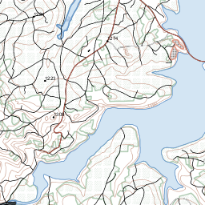
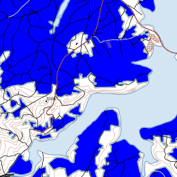

topostyle
=========

Open publication and styling of South African 1:50000 topographical map vector data from NGI

Copyright (C) 2013 - present AfriSpatial, Kartoza

Authors:
* Admire Nyakudya
* Gavin Fleming

 topostyle by <a xmlns:cc="http://creativecommons.org/ns#" href="http://afrispatial.co.za" property="cc:attributionName" rel="cc:attributionURL">AfriSpatial</a> is licensed under a <a rel="license" href="http://creativecommons.org/licenses/by-sa/2.5/za/deed.en">Creative Commons Attribution-ShareAlike 2.5 South Africa License</a>.

All files in this repository fall under this CC BY-SA 2.5 ZA licence EXCEPT the files in the scripts directory, which are GPL licenced. This licence also covers all cartographic products produced using these styles, including web map image tiles. 

Aim
===
A free, public set of styles and scripts that will enable anyone to publish the free data available from NGI (http://www.ngi.gov.za) as web or desktop maps that look exactly like the published map sheets, starting with 1:50000 topographical maps. Hopefully this will also be endorsed, used and contributed to by NGI. 

We at AfriSpatial have invested in getting the map and styles to the point where we feel confident to share them. We hope you find these useful. This is a work in progress. We know there is lots of space for improvement so if you see something that could be styled better, please do it!

Objective
=========
Style the maps to look as close as possible to the familiar topo map sheets in the following context:

1. all styles to be defined in OGC SLD (Styled Layer Descriptor)
 1. in most cases SLD / SE v 1.1. http://portal.opengeospatial.org/files/?artifact_id=16700
 2. in some cases SLD v 1.0, where GeoServer has not implemented a 1.1 element. http://portal.opengeospatial.org/files/?artifact_id=1188
 3. Use GeoServer extensions (CQL filters, geometry transformations, etc) and VendorOptions where SLD is lacking.
2. custom graphics in SVG or png formats
3. conform to NGI published specifications where available (http://www.ngi.gov.za/index.php/Standards/standards.html). Docs in the 'specs' directory specify almost everything except layer order. 
4. Look 'perfect' at and around 1:50000. Then extend to scale and generalise at smaller scales.
5. Extend the project to other data sets, such as 5m contours, 1:250000 maps, etc. This will involve lots more advanced styling and data management including possibly generalisation. 

See the styles in action
========================

See it being served by QGIS server at http://maps.kartoza.com/Topostyle/

Alternatively, 1Map is kindly hosting an instance of the NGI data, managed by Kartoza and served by GeoServer.

1. Register with http://1map.co.za
2. Find or browse to somewhere in South Africa
3. Zoom to 1:64000 or closer
4. switch on the 1Map/base/NGI layer
5. optionally, change the base layer to 'None'

You will see the current version of the map, not necessarily with the latest styles or layer order (because it is cached for speed). The cached map will be refreshed whenever there is an accepted improvement. 

**Bonus:** The 'Imagery' layer on 1Map is the NGI aerial photography for the whole country. It's great to switch that on below the topo layer and make the topo layer a little transparent. 

Using the layer
---------------
You may use the layer as published by the 1Map service in your own web apps and desktop GIS but only under these conditions:
1. You attribute the layer correctly according to the licence above.
2. You use the cached layer and not the normal WMS layer. i.e. use the 'afrispatial:NGI' layer available at http://www.onemap.co.za/geoserver/gwc/service/wms?TILED=true

The 'NGI' layer on 1Map
=======================

This is a *group layer* consisting of nearly forty separately-styled WMS layers. 

The aim is to improve each individual layer style and the way they interact in the group (layer order, transparency) to perfect the map.

Working with the map and testing style changes
==============================================

The idea is to edit the styles to improve them. Once they represent an improvement you are satisfied with, you commit to github or make a pull request, depending on your commit rights. 

1. If you have the four-DVD set of shapefiles from NGI (free public data), you can use the scripts available here to load them all into PostGIS (http://postgis.refractions.net) and publish and style them. You can do this on your own computer, or a server on your LAN / Internet / Cloud.

 1. load the shapefiles into PostGIS with the bash loader script (open and modify it first if necessary). This will add the data from every single shapefile in every single map sheet into one country-wide layer per feature type.
 2. Run the SQL script. It does a few bulk data cleanups, such as dropping unnecessary fields and merging tables representing the same feature types.
 3. publish the layers via your own instance of GeoServer or any other web map server that can use SLD styles. Or open the PostGIS layers in a desktop GIS like QGIS or uDIG and apply and edit the styles there. 

    The layer names, field names and class values that we use map to or match those of the NGI data sets. For a list of map layers, just see the names of the SLD files. They match the database table names AND the WMS layer names. Some layers are repeated / split in the styling where we deemed necessary. Where the SLD has a number such as 'airtransportarea2.sld', it still refers to the database table "airtransportarea" but indicates that it has been published as more than one layer, each rendering different feature classes. 

    We have refrained from any data editing and publish the data *as is*, warts and all. As long as NGI keeps the same format, you should be able to load their next releases without breaking the map.

The road style has been modified from the normal style that is in the specification of the NGI to one that does have a nice rendering effect in geoserver. The style has been tweaked a little bit to allow nice visualisation when all the layers are grouped together. The SLD has been incoperated into github.

2. If you don't have the data or hardware, you can still work on the styles and see the effects of your edits and improvements. 

 1. make WMS GetMap http POST requests against the 1Map GeoServer WMS service, specifying your SLDs. This will override the styles on the server for that request only. General details for how to do that are explained here: http://geo-solutions.blogspot.com/2012/04/dynamic-wms-styling-with-geoserver-sld.html. You can request one or more layers or even all the layers representing the whole map and manipulate individual layers and layer order. 

 Examples
 --------

To see part of the map 'as is', use a request like this in a browser:

http://1map.co.za/geoserver/wms?LAYERS=afrispatial:NGI&FORMAT=image/png&TRANSPARENT=true&&SERVICE=WMS&VERSION=1.1.1&REQUEST=GetMap&STYLES=&SRS=EPSG:900913&BBOX=3248267.9567958,-3350999.3172331,3253159.9266061,-3346107.3474228&WIDTH=256&HEIGHT=256 

or from the command line as a GET request:

> curl -G -o map.png 'http://1map.co.za/geoserver/wms?LAYERS=afrispatial:NGI&FORMAT=image/png&TRANSPARENT=true&&SERVICE=WMS&VERSION=1.1.1&REQUEST=GetMap&STYLES=&SRS=EPSG:900913&BBOX=3248267.9567958,-3350999.3172331,3253159.9266061,-3346107.3474228&WIDTH=256&HEIGHT=256'

or the same request from the command line as a POST request:

> curl --data-binary -X POST -H "Content-type: application/xml" -T docs/getmap.xml -o map.png 'http://1map.co.za:8080/geoserver/wms/GetMap'

then look at 'map.png' in an image viewer. It should look something like this...

To apply a modified style to one layer: 

Here we POST a GetMap request listing all the layers we want in our map, in the order we want them. All will use the default / pre-defined styles that have been set on the server, except for 'vegetationarea' where we've inserted the <UserStyle> element from the sld file and changed the colour of cultivated land to blue.

> curl --data-binary -X POST -H "Content-type: application/xml" -T docs/getmap_withlocalstyle.xml -o map.png 'http://1map.co.za:8080/geoserver/wms/GetMap'

You should get something like this...

Workflow
========
1. Clone the repository and create a branch for your development work, preferably.
1. Copy the UserStyle element from the SLD(s) of interest into the appropriate 'NamedLayer' elements in an xml document as in docs/getmap_withlocalstyle.xml
2. Make your desired changes
3. POST with curl and test
4. If you like the changes, update the 'master' sld with the improvements that you made.
5. Commit or make a pull request.

Note
====
1. You can make your requests using latlong coordinates (EPSG: 4326) or Web Mercator coordinates (EPSG: 900913 or 3857)
2. Instead of using curl to make POST requests from the command line you can use, for example, one of various FireFox add-ons that give you a form to use in your browser.

Please add more examples!

Some Tools to Use
=================

The initial styling of the data was achieved using QGIS and several of the following tools. For more complex styles you have to get your hands dirty with the XML directly. 

In styling the data in QGIS we realised that not all the SVG symbols which were specified on the 1:50 000 reference sheets existed in the 
SVG directory for QGIS hence the need to create the svg symbols using InkScape. They are subsequently stored in a folder which can be referenced.

Since the original styling was done using QGIS it now incorporates the advanced labelling feature which makes it easy for a layer to be labelled and also eliminates the process of bringing in the layer twice in a view in order to label the feautures.

**SLD Editing**

GUI-based but with some incomplete implementation or non-standard extensions:
* QGIS
* uDIG
* Atlas Styler

Hand editing the XML:
* Any text or XML editor, with the SLD specifications close by and a browser to search for examples. 

**SVG Editing**

InkScape

**png Editing**

GIMP

---

Manipulating layers and Styles via the GeoServer REST API
=========================================================

Note: you need to authenticate with admin rights to do this. We would make requests like this once an improved style is committed and we want to update the live map permanently. 

Publishing a layer
------------------
>curl -v -u username:password -X POST -H "Content-type: text/xml" -d "<featureType><name>airtransportarea</name></featureType>" http://1map.co.za/geoserver/rest/workspaces/quidity/datastores/ngi/featuretypes

Creating a style using rest API
-------------------------------

>curl -v -u username:password -X POST -H "Content-type: text/xml"  -d ""  http://1map.co.za/geoserver/rest/styles

Populate an empty style
-----------------------

>curl -v -u username:password -X PUT -H "Content-type: application/vnd.ogc.sld+xml" -d @/home/admire/Documents/workingfiles/ngi/ngistyles_sld/islandarea.sld http://1map.co.za:8080/geoserver/rest/styles/islandarea

Associate a style with a layer, remove the enabled and associate the layer with a style so that it goes to default enabled and advertised.
------------------------------------------------------------------------------------------------------------------------------------------

>curl -v -u username:password -X PUT -H "Content-type: text/xml"  -d "<layer><defaultStyle><name>islandarea</name></defaultStyle><enabled>true</enabled></layer>" http://1map.co.za:8080/geoserver/rest/layers/quidity:islandarea

Create a layer group
--------------------

First create a xml document and then use the REST API. The working group layer definition XML doc is in the sld directory.

>curl -u username:password -X POST -d @/home/admire/Documents/workingfiles/ngi/ngistyles_sld/ngLayerGroup.xml -H 'Content-type: text/xml' http://1map.co.za:8080/geoserver/rest/layergroups

